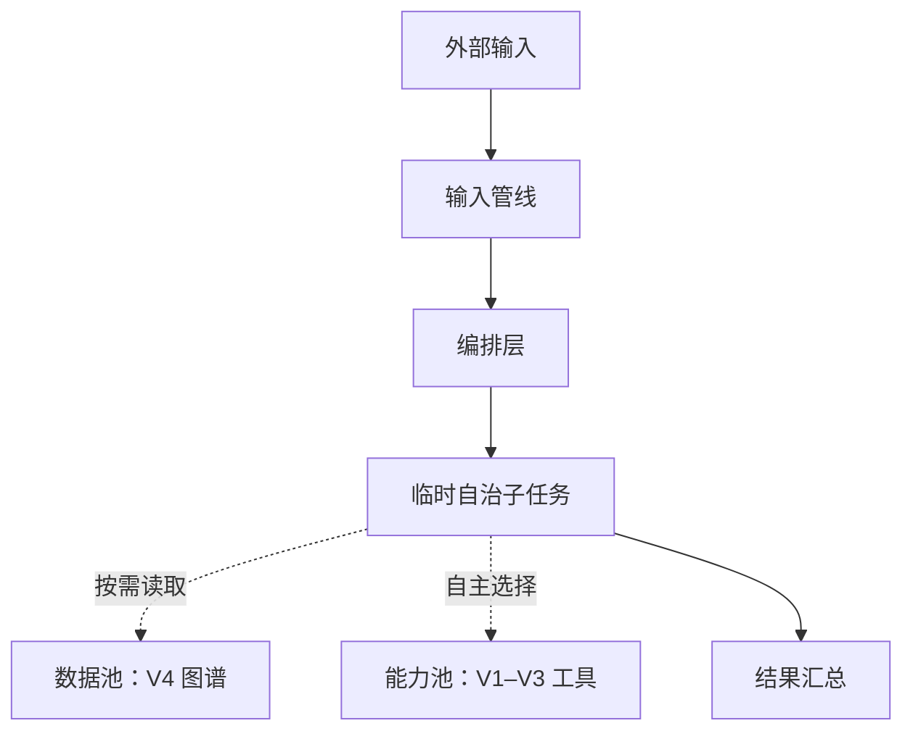
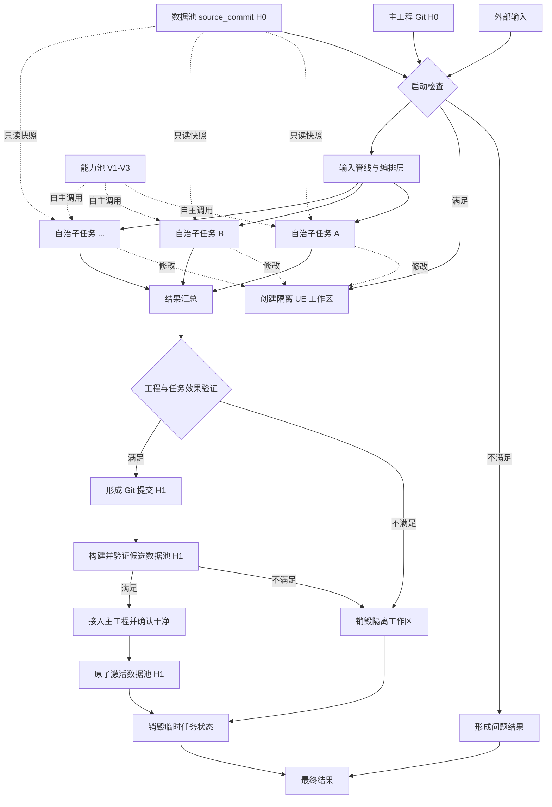

# SEED-001：UE-ITPS 最终完整产品架构

## 1. 定位

本文记录 2026-08-04 对 UE-ITPS 最终产品形态的完整架构讨论。

这不是当前 V4 原型的立即重构计划，也不改变当前工程主线。当前实现仍然是：

- V1–V3：16 个单一职责、只读、稳定 JSON 契约的 UE 工程探针。
- V4：复用 V1–V3 探针，将项目级 C++ 符号与关系写入 SQLite，并提供查询、并行扫描和可恢复缓存。
- 当前工程阶段：继续验证图谱、探针与 UE 工程事实，不进入写工程、自治编排或完整产品化。

本文描述的是上述能力成熟之后的最终产品架构，用于未来里程碑触发，而不是驱动当前范围膨胀。

## 2. 产品目标

最终产品是一个面向 Unreal Engine 工程的确定性任务控制系统。它需要：

1. 将现有 V1–V3 能力统一组织成能力池。
2. 将 V4 图谱演进为系统级、可组合的工程数据池。
3. 通过输入管线和编排层解析主任务，生成有明确职责、定位、输入、输出和依赖关系的子任务。
4. 允许子任务持有临时状态、进行多轮决策，并自主读取数据和选择工具。
5. 隔离工具原始输出、中间推理和临时状态，只向主任务上交任务相关结果。
6. 使用 Git 和隔离工作区保护真实 UE 工程，避免任务结果污染后续工程和数据图谱。
7. 保证数据池版本始终与一个明确的工程 Git 提交绑定。
8. 使用 Codex 作为智能执行引擎，但由独立控制核心负责确定性约束、Git 事务、UE 状态检查和数据版本切换。

## 3. 核心架构结论

### 3.1 双池平级

V4 数据图谱不位于 V1–V3 工具之上，也不直接驱动工具。最终系统具有两个平级资源池：

- **能力池**：回答“系统可以做什么”。
- **数据池**：回答“当前工程有哪些已知事实、关系、证据和上下文”。

输入管线位于两个池之上，负责组织如何读取数据和应用工具。数据池与能力池互不控制。



### 3.2 能力池

能力池在当前阶段不修改。未来只统一注册和发现现有 V1–V3 能力，不改变各工具已经稳定的职责边界与输出契约。

普通任务可以读取和调用能力，但不能修改能力本体。新增、删除、升级工具，或改变接口和权限，必须属于独立的系统维护流程，而不是普通主任务的副作用。

能力池未来至少需要描述：

- 能力标识和职责。
- 输入、输出与边界。
- 只读或写入属性。
- 是否幂等。
- 允许作用的工作区类型。
- 依赖环境和验证方式。

但这些元数据属于后续产品化设计，当前 V1–V3 不因此重构。

### 3.3 数据池

数据池是具体 UE 工程的抽象表达，不是独立于工程的第二事实源。

必须遵守：

> UE 工程是事实源；数据池是绑定明确 Git 提交的派生视图。

数据可以分为两类：

| 类型 | 例子 | 更新方式 |
|---|---|---|
| 工程派生事实 | 文件、Module、Plugin、类型、函数、资产、引用和关系 | 从已提交的工程版本扫描生成 |
| 产品补充语义 | 设计意图、决策、人工标注、审查边界 | 通过单独的回写闸门写入 |

未经验证的推测、临时工具输出和任务过程状态不能进入正式数据池。

数据池必须保存其来源修订：

```text
active_data_pool.source_commit == canonical_project.git_head
```

## 4. 输入管线与编排层

输入管线是主任务的入口。其内部编排层只组织任务结构，不处理任务内容。

编排层负责：

1. 解析目标、约束和预期结果。
2. 将主任务拆分为多个小任务。
3. 为每个子任务明确职责和定位。
4. 明确每个子任务的输入和输出契约。
5. 推导任务间依赖关系。
6. 判断哪些任务可以并行。
7. 检查潜在的文件、资产和资源写入冲突。

编排层不负责：

- 读取并解释具体工程内容。
- 执行工具。
- 清洗工具输出。
- 代替子任务做领域判断。
- 代替结果汇总层重写子任务内容。

并行判断不能只依赖语义相似度，还必须考虑数据依赖、输出依赖、文件重叠、UE 资产引用和工具副作用。

## 5. 子任务执行模型

子任务是可以持有状态、进行多轮决策的临时自治执行体。

每个子任务能够：

- 根据自身目标读取数据池快照。
- 自主判断需要调用哪些能力。
- 保留临时上下文和工具原始输出以继续多轮执行。
- 依据输入输出契约生成任务相关结果。

必须分离两类内容：

| 内容 | 生命周期 | 是否上交汇总层 |
|---|---|---|
| 工具原始输出、中间上下文、多轮工作状态 | 子任务临时持有，任务结束销毁 | 否 |
| 符合任务输出契约的规范化结果 | 供主任务汇总使用 | 是 |

子任务不能将工具输出的全部内容打包给主任务。结果汇总层只接收与任务直接相关的正式输出。

子任务结束后，不保留其定义、状态、工具原始输出或执行过程。若需要重新执行，应根据主任务重新生成子任务，而不是恢复子任务内部步骤。

## 6. 主任务与最终结果

主任务运行期间可以临时保存：

- 目标与约束。
- 子任务定义和依赖图。
- 子任务当前状态。
- 已完成子任务的规范化结果。
- 汇总进度。

主任务结束后，以上运行态全部销毁。长期保留的是最终结果；工程和数据池则作为系统状态独立存在。

产品语义上不把主任务分类为“成功、失败或取消”。主任务始终收敛为一个结果，这个结果可能描述完成、部分完成、无法完成、缺失条件或运行异常。

结果内容由具体任务动态定义，但必须具有稳定的语义骨架：

```text
最终结果
├─ 需要做什么：目标、步骤或建议动作
├─ 做到哪里：已完成内容、进展和交付物
└─ 出了什么问题：阻碍、缺失信息、异常和未满足条件
```

运行时仍然可能发生进程崩溃、存储中断或工具异常。它们不需要成为产品对外的主任务状态，但必须最终转化为结果中的问题说明。

## 7. 为什么不能直接回写数据池

最初设想是由最终结果生成数据池变更，但发现存在自我污染风险：

```text
读取数据池
→ 任务推论不准确
→ 直接写回数据池
→ 后续任务把错误推论当作事实
→ 产生影响范围更大的修改
→ 错误不断自我强化
```

仅对数据池做快照无法解决问题，因为工具可能已经修改了真实 UE 工程。UE 的 C++、Build.cs、Target、Config、Blueprint、资产、地图和引用关系高度耦合；真实工程被污染后，下一次扫描仍会把污染写回数据池。

因此最终结论是：

- 工程事实不能由自然语言结果直接写入数据池。
- 子任务不能直接写主工程。
- 任务只能在隔离工程工作区产生候选工程变更。
- 工程变更验证并正式提交后，再从该提交重新生成候选数据池。
- 候选数据池通过验证后才能成为激活版本。

## 8. Git 事务与 UE 工程隔离

Git 是工程事实版本和数据池版本之间的锚点，也是任务的事务边界。

### 8.1 主任务启动条件

启动主任务前必须同时满足：

1. UE Editor 不存在未保存的 Dirty Package。
2. Git 工作区不存在已跟踪或未跟踪的待提交文件。
3. 当前工程 HEAD 是一个明确提交 `H0`。
4. 当前激活数据池的 `source_commit` 等于 `H0`。

仅检查 Git 不够，因为 Git 看不到编辑器内尚未保存的地图和资产。

### 8.2 隔离工作区

主任务不直接修改主工作区。系统从 `H0` 创建独立 Git worktree 或等价隔离 UE 工作区：

- 纯 C++ 修改可以使用标准 Git worktree。
- 涉及 `.uasset`、`.umap` 或编辑器操作时，需要能够独立加载的 UE 工作区。
- 并行任务不能同时修改相同资产或存在强引用写冲突的资产组。
- 二进制资产应考虑 Git LFS 和锁定机制。
- `Intermediate`、`Saved`、`DerivedDataCache` 等生成目录必须正确忽略。

能力池中的写工具只能作用于隔离工作区，禁止直接写主工程。

### 8.3 验证、提交与数据池更新

候选工程修改完成后，至少执行：

- 编译与 UHT 检查。
- 与修改范围相符的自动化测试。
- UE 资产引用和重定向器检查。
- 必要的 Editor 加载或运行检查。
- 变更范围与任务职责检查。

只有满足预期，才在任务分支形成提交 `H1`。Git 提交只是稳定版本边界，不等于质量证明；质量验证必须发生在提交晋升前。

从 `H1` 构建候选数据图谱并验证后，进入串行版本切换临界区：

1. 暂停新主任务启动。
2. 将 `H1` 无冲突接入主工程。
3. 确认主工程再次处于已提交且干净的状态。
4. 原子激活 `source_commit = H1` 的候选数据池。
5. 释放任务启动锁。

如果工程验证、数据图谱验证或版本接入任一步骤不满足条件，则不激活新数据池，并把实际情况写入最终结果。

数据池文件应位于工程仓库之外或受控的忽略目录中，否则刷新数据池本身会让工程重新变脏。

## 9. 总体生命周期



## 10. Codex 与独立 Coding Agent 的产品边界

最终产品不应只是一组运行在 Codex 内的提示词或 Skill，也没有必要从零重写完整的代码 Agent。

确认采用：

> 独立的确定性控制核心 + Codex 智能执行与交互层。

如果必须在“纯 Codex 产品”和“独立 Coding Agent”之间二选一，应选择独立产品核心，但继续使用 Codex 作为代码理解、工具选择和任务执行引擎。

### 10.1 Codex 负责

- 理解用户输入。
- 承担有状态、多轮的子任务执行。
- 基于任务目标选择数据和工具。
- 处理代码、配置、分析和验证内容。
- 返回经过筛选的任务相关结果。

### 10.2 独立控制核心负责

- 主任务启动门槛。
- 编排规则与任务契约。
- Git、worktree 和工程锁。
- UE Dirty Package 检查。
- 并行写冲突控制。
- 工程验证门槛。
- 工程提交和版本晋升。
- 数据池构建、验证和原子切换。
- 临时任务状态清理。
- 最终结果封装。

这些约束不能只依赖提示词让模型“自觉遵守”，必须由确定性代码强制执行。

### 10.3 Codex 扩展面映射

| 产品概念 | 推荐实现 |
|---|---|
| V1–V3 能力池 | MCP 工具或现有本地工具注册层 |
| V4 数据池 | 独立本地服务或数据库，通过 MCP/受控 API 查询 |
| 可复用工作流 | Codex Skill |
| 产品分发 | Codex Plugin，可打包 Skill、MCP 和辅助 Hook |
| 工具调用防护 | Codex Hook 作为第二层保护，不作为主状态机 |
| 自治执行体 | Codex thread/subagent 或 Codex SDK 驱动的执行单元 |
| 确定性编排 | 独立控制器，调用 Codex SDK/App Server 或 Agents SDK |

Codex 原生 Agent 线程和追踪可能保留比产品目标更多的执行信息，因此“子任务结束即销毁”的严格语义必须由独立产品层定义和执行；Codex 内 MVP 可以接受较弱的保留语义，但不能把它误认为最终实现已经满足要求。

## 11. 推荐演进路线

### 阶段 A：当前工程主线

- 保持 V1–V3 探针只读和单一职责。
- 继续验证 V4 图谱的正确性、确定性、证据和性能。
- 不引入写工程能力、自治编排、能力池重构或 Git 事务控制。

### 阶段 B：产品概念验证

- 将 V1–V3 通过稳定注册表暴露为能力池。
- 将 V4 查询封装为数据池读取接口。
- 在 Codex Plugin/Skill 中验证任务拆分、数据读取、工具选择和规范化结果。
- 所有工程操作仍保持只读。

### 阶段 C：隔离写入验证

- 实现独立 Git/worktree 控制器。
- 增加 UE Dirty Package 和工程加载检查。
- 写工具只能操作隔离工作区。
- 建立候选工程变更、验证和提交协议。

### 阶段 D：完整产品架构

- 实现确定性主任务状态机和临时自治子任务。
- 实现工程提交与数据池版本绑定。
- 实现候选数据图谱验证和原子激活。
- 实现并行冲突控制与最终结果生命周期。
- Codex 作为默认交互和执行入口，同时允许独立 UI 或 CLI 使用同一控制核心。

## 12. 已确认的不做事项

- 当前不修改能力池中的 V1–V3 工具。
- 不让 V4 图谱成为能力池的上级编排器。
- 不让普通任务修改能力池本体。
- 不让子任务直接写主工程。
- 不让自然语言最终结果直接改写工程事实图谱。
- 不让当前任务读取自己尚未晋升的共享数据池版本。
- 不把 Git 提交等同于效果验证。
- 不依靠提示词单独保证工程事务和安全边界。
- 不为了最终架构打断当前 V4 图谱验证主线。

## 13. 未来仍需决策

进入触发里程碑后，需要重新讨论并验证：

1. 独立控制核心使用 Codex SDK、Codex App Server、Agents SDK，还是组合使用。
2. 数据池的正式存储模型、版本组织和原子切换机制。
3. 工程派生事实与人工补充语义是否分库或分命名空间。
4. Git 快进、合并提交和并发主任务的版本策略。
5. UE Editor Dirty Package 的可靠检测和无交互保存策略。
6. `.uasset`、`.umap` 的 Git LFS 与锁机制。
7. 写工具权限模型和不同工作区类型。
8. 工程验证矩阵：C++、Blueprint、资产、地图、网络和打包。
9. Codex 子任务信息保留与产品“临时执行体”语义之间的适配。
10. 数据池构建失败时如何维持工程与激活图谱的一致性。

这些问题在当前阶段没有足够事实支持，不应提前锁死实现。

## 14. 未来验收信号

完整架构可以被认为成立，需要至少证明：

- 主工程不因未通过验证的任务发生变化。
- 任意激活数据池都能追溯到唯一有效 Git 提交。
- 启动新主任务时，工程 HEAD 与数据池 `source_commit` 必然一致。
- 子任务无法绕过控制器直接写主工程。
- 并行子任务不会无控制地写入同一 UE 资产或强关联资产组。
- 工程修改可以在隔离环境完成必要的编译、测试和加载验证。
- 工具原始输出不会污染最终结果。
- 主任务结束后，产品不依赖已销毁的子任务状态继续工作。
- 任何实际完成程度都能通过“需要做什么、做到哪里、出了什么问题”表达。
- Codex 被替换或升级时，Git、UE 和数据池的一致性约束仍由独立控制核心保证。

## 15. 当前工程面包屑

- `.planning/PROJECT.md`：当前里程碑仍以 UE 5.6.1/Lyra 工程事实和可复现证据为主。
- `docs/PROGRAM-DESIGN.md`：V1–V3 当前正式工具边界与只读契约。
- `v4/README.md`：当前 V4 项目级符号图谱、SQLite、并行扫描和可恢复缓存。
- `v4/ue_itps_v4/graph_builder.py`：当前工程事实到图模型的构建入口。
- `v4/ue_itps_v4/storage.py`：当前图谱持久化边界。
- `v4/ue_itps_v4/query.py`：当前图谱查询边界。
- `.planning/codebase/ARCHITECTURE.md`：已验证的 Lyra 工程架构事实。
- `.planning/codebase/PIPELINES.md`：Experience、Pawn 初始化和运行管线证据。

## 16. 外部产品依据

- Codex Subagents：<https://learn.chatgpt.com/docs/agent-configuration/subagents.md>
- Codex Worktrees：<https://learn.chatgpt.com/docs/environments/git-worktrees.md>
- Codex Hooks：<https://learn.chatgpt.com/docs/hooks.md>
- Codex SDK：<https://learn.chatgpt.com/docs/codex-sdk.md>
- Codex Plugin Architecture：<https://developers.openai.com/plugins/concepts/plugins>

---

本 Seed 在触发条件满足前保持休眠。当前工作继续沿现有 V4 图谱和 UE 工程事实验证主线推进。
