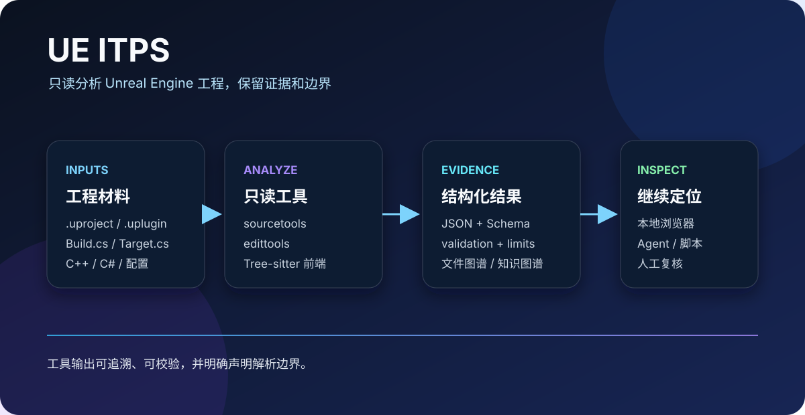

# UE ITPS

<p align="center">
  <strong>面向 Unreal Engine 工程的只读分析工具集</strong><br />
  将工程描述符、构建规则、C++/C# 源码和可选的 Editor 证据转换为可检索的结构化结果。
</p>

<p align="center">
  <a href="LICENSE"></a>
  <a href="https://www.python.org/"></a>
  <a href="show/README.md"></a>
</p>

<p align="center">
  
</p>

UE ITPS 用于回答“这个 Unreal Engine 工程里有什么、它们如何关联、我应该从哪里继续阅读”这类问题。工具只读明确选择的文件、配置范围或 Editor 证据，并输出带有 `validation` 和 `limits` 的 JSON，方便脚本、浏览器和 Agent 继续消费。

## 能力范围

| 子系统 | 作用 |
| --- | --- |
| `sourcetools/` | 工程、构建、模块、Include、类型、函数、依赖和 Scope 导航的核心 CLI |
| `edittools/` | 资产、Blueprint、配置、Gameplay Message 和知识图谱相关的 Editor/离线 CLI |
| `information_pool/` | 扫描工程文件并生成带证据的 SQLite 文件图谱 |
| `show/` | 在浏览器中本地搜索文件、证据和关系 |
| `mcp_connection_pool/` | 被动匹配宿主已暴露的 UE 只读连接 |
| `tests/` | 统一运行核心、组件和 Lyra 回归测试 |

## 快速开始

### 环境

- Python 3.10 或更高版本
- Node.js 22.13 或更高版本（仅运行 `show/` 时需要）
- Git，以及可用的 `parsers/tree-sitter-ue-cpp` 子模块

### 安装

```bash
git clone https://github.com/qloveyzdd/UE_ITPS.git
cd UE_ITPS
git submodule update --init --recursive
python -m pip install -r requirements.txt
python -m pip install -r requirements-dev.txt
```

### 使用核心 CLI

先发现目标工程，再明确选择一个 `.uproject`：

```bash
python sourcetools/ue_find_projects.py --search-root D:/Projects
python sourcetools/ue_list_tools.py
```

例如，查看一组 C++ 文件中的函数定义：

```bash
python sourcetools/ue_list_cxx_functions.py \
  --source D:/Projects/MyGame/Source/MyGame/Private/MyActor.cpp \
           D:/Projects/MyGame/Source/MyGame/Public/MyActor.h
```

所有 CLI 都输出 JSON。`validation` 描述本次扫描是否有问题，`limits` 说明结果边界；退出码 0、1、2 分别表示完成、发现阻断问题、参数或输入失败。

### 启动本地浏览器

`show/` 用于查看由 `information_pool/` 或知识图谱工具生成的本地 JSON/SQLite 文件：

```bash
cd show
npm ci
npm run dev
```

页面在浏览器内读取图谱，不上传数据，也不会修改 Unreal 工程。页面测试使用：

```bash
npm test
```

## 仓库结构

| 路径 | 内容 |
| --- | --- |
| `sourcetools/` | 静态工程与源码分析入口 |
| `edittools/` | Editor/离线证据与知识图谱入口 |
| `information_pool/` | 文件图谱扫描与存储 |
| `show/` | 本地图谱浏览器 |
| `schemas/`、`edittools/schemas/` | CLI 输出契约 |
| `docs/` | 架构、开发和测试说明 |
| `tests/` | Python 回归测试 |
| `parsers/tree-sitter-ue-cpp/` | 独立维护的语法子模块 |
| `LyraStarterGame/`、`ExternalProjects/` | 本地参考工程，默认不纳入仓库分发 |

## 测试与验证

从仓库根目录执行：

```bash
python -m tests --suite core
python -m tests --suite components
python -m tests --suite lyra -v
```

`lyra` 套件需要本地 Lyra 工程和可解析的 Engine 环境；没有这些前提时，测试会明确报告环境问题。完整的套件范围和验证边界见[测试与验证](docs/TESTING.md)。

## 设计边界

- 源码工具只解析明确选择的文件或配置范围，不执行预处理、编译、UHT 或跨文件语义绑定。
- 候选调用、委托和有限 UE API 契约用于导航和复核，不代表编译可见性、重载决议或运行时派发已经确定。
- Editor 结果是现场证据；离线扫描结果不能替代真实 Editor、PIE、网络模式或资产行为验证。
- 文件图谱当前是文件级存储，没有 Git 提交绑定、不可变历史快照或增量更新。
- `LyraStarterGame/` 和 `ExternalProjects/` 是本地参考工程，不属于 UE ITPS 工具实现。

更细的入口说明见[工具清单](docs/TOOLS.md)，架构边界见[架构说明](docs/ARCHITECTURE.md)，开发约定见[开发说明](docs/DEVELOPMENT.md)。

## 参与贡献

欢迎提交问题、改进建议和经过验证的修复。开始前请阅读[贡献指南](CONTRIBUTING.md)，并确认改动没有把生成目录、Epic/Lyra 内容或本地环境文件带入提交。

## 许可证与第三方声明

UE ITPS 自有源码和文档采用 [Apache License 2.0](LICENSE)。

仓库中使用的 Tree-sitter、ast-outline、gdep 以及其他依赖保留各自的上游许可，详见 [THIRD_PARTY_NOTICES.md](THIRD_PARTY_NOTICES.md) 和 [`LICENSES/`](LICENSES/)。这些声明不会把第三方代码重新授权为 UE ITPS 自有内容。

`LyraStarterGame/`、`ExternalProjects/` 和 Unreal Engine 相关内容是本地参考工程，继续受各自上游许可和分发条件约束；本仓库的 Apache-2.0 许可证不授予 Epic Games、Unreal Engine 或这些参考工程的额外权利。
